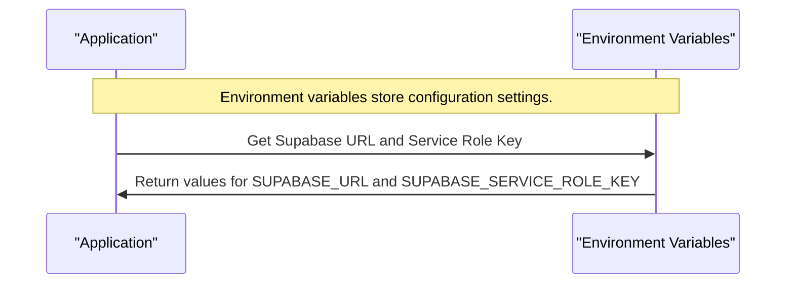
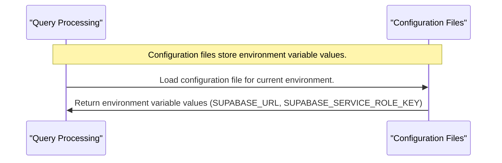

# Chapter 1: Environment Configuration

Here is the integrated chapter markdown with Mermaid diagrams:

# Chapter 1: Environment Configuration
==============================

As we start building our Supabase MCP server, one of the first things we need to consider is how it will interact with its environment variables. These variables hold sensitive information like our Supabase URL and service key, which are crucial for authentication and database operations.

Imagine you're working on a project that requires connecting to various databases using different credentials. You don't want to hardcode these credentials directly into your code, as this would compromise security and make maintenance more difficult. That's where environment configuration comes in – it helps manage how our application interacts with its environment variables for configurations like Supabase URL and service key.

Let's break down the concept of environment configuration in simple terms:

### What are Environment Variables?



### Why Do We Need Environment Configuration?

```mermaid
flowchart TB
    participant App as "Supabase MCP Server"
    participant Databases as "Multiple Databases"

    Note over App,Databases: Multiple databases with different credentials.

    App->>Database1: Connect to Database 1 using hardcoded credentials.
    App->>Database2: Connect to Database 2 using hardcoded credentials.

    Note over App: Hardcoded credentials make maintenance difficult and compromise security.

    App->>EnvVars: Use environment configuration for secure credentials.
    EnvVars->>App: Return correctly configured credentials for each database
```

### Key Concepts

To understand how environment configuration works, let's break down key concepts:

1. **Environment Variables**: These are named values that contain information about the environment.
2. **Configuration Files**: These files store environment variable values for different environments (dev, prod, etc.).
3. **Loading Environment Variables**: This is the process of making environment variables available to our application.



### Using Environment Configuration

Now that we've covered the basics, let's see how we can use environment configuration in our Supabase MCP server:

```python
import os

# Load environment variables from a configuration file
supabase_url = os.getenv('SUPABASE_URL')
supabase_service_role_key = os.getenv('SUPABASE_SERVICE_ROLE_KEY')

print(f"Loaded Supabase URL: {supabase_url}")
print(f"Loaded Supabase Service Role Key: {supabase_service_role_key}")
```

In this example, we use the `os` module to load environment variables from a configuration file. The `getenv()` function returns the value associated with a given variable name.

### Conclusion

In this chapter, we learned about the importance of environment configuration in managing our application's interactions with its environment variables. We covered key concepts like environment variables, configuration files, and loading environment variables. With this foundation, you're now ready to move on to the next chapter, which covers [Supabase Context Manager](02_supabase_context_manager_.md)....

---

Generated by [TutorialForge](https://github.com/your-username/tutorialforge) - AI-Powered Codebase Tutorial Generator