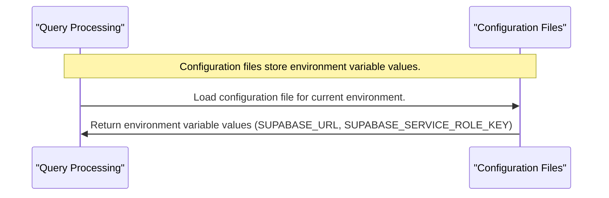
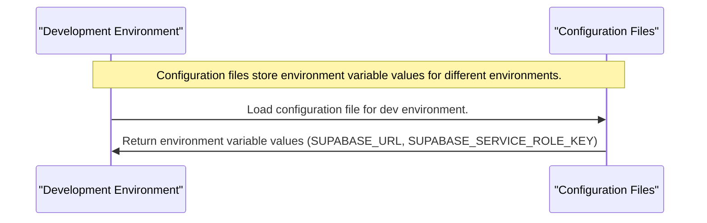
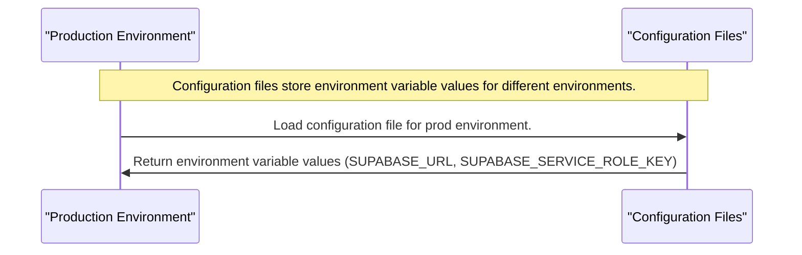

# Chapter 2: Configuration Files
==============================

As we build our Supabase MCP server, we need to consider how it interacts with its environment variables. These variables hold sensitive information like our Supabase URL and service key, which are crucial for authentication and database operations.

Imagine you're working on a project that requires connecting to various databases using different credentials. You don't want to hardcode these credentials directly into your code, as this would compromise security and make maintenance more difficult. That's where configuration files come in – they help manage how our application interacts with its environment variables for configurations like Supabase URL and service key.

### What are Configuration Files?

Configuration files store environment variable values for different environments (dev, prod, etc.). Think of them as locked chests where you keep your passwords and keys safely hidden from prying eyes. 

Let's break down the concept of configuration files in simple terms:

*   **Environment Variables**: These are named values that contain information about the environment.
*   **Configuration Files**: These files store environment variable values for different environments (dev, prod, etc.).
*   **Loading Environment Variables**: This is the process of making environment variables available to our application.

### Why Do We Need Configuration Files?



### Using Configuration Files

Now that we've covered the basics, let's see how we can use configuration files in our Supabase MCP server:

```python
import os

# Load environment variables from a configuration file
supabase_url = os.getenv('SUPABASE_URL')
supabase_service_role_key = os.getenv('SUPABASE_SERVICE_ROLE_KEY')

print(f"Loaded Supabase URL: {supabase_url}")
print(f"Loaded Supabase Service Role Key: {supabase_service_role_key}")
```

In this example, we use the `os` module to load environment variables from a configuration file. The `getenv()` function returns the value associated with a given variable name.

### Managing Configuration Files Across Environments

Different environments (development, production, etc.) require their own unique set of environment variables. Let's take a look at how we can manage these configuration files for different environments:



Similarly, we can have configuration files for production and other environments:



### Loading Environment Variables from a Configuration File

When our application starts up, it needs to load the relevant environment variables from the configuration file:

```mermaid
flowchart LR
    participant App as "Application"
    participant ConfigFiles as "Configuration Files"

    Note over App,ConfigFiles: Loading environment variables from a configuration file.

    App->>ConfigFiles: Load configuration file for current environment.
    ConfigFiles->>App: Return environment variable values (SUPABASE_URL, SUPABASE_SERVICE_ROLE_KEY)
```

### Conclusion

In this chapter, we learned about the importance of configuration files in managing our application's interactions with its environment variables. We covered key concepts like environment variables, configuration files, and loading environment variables. With this foundation, you're now ready to move on to the next chapter, which covers [Supabase Context Manager](03_supabase_context_manager_.md)....

---

Generated by [TutorialForge](https://github.com/your-username/tutorialforge) - AI-Powered Codebase Tutorial Generator