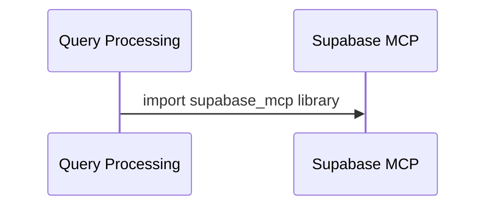
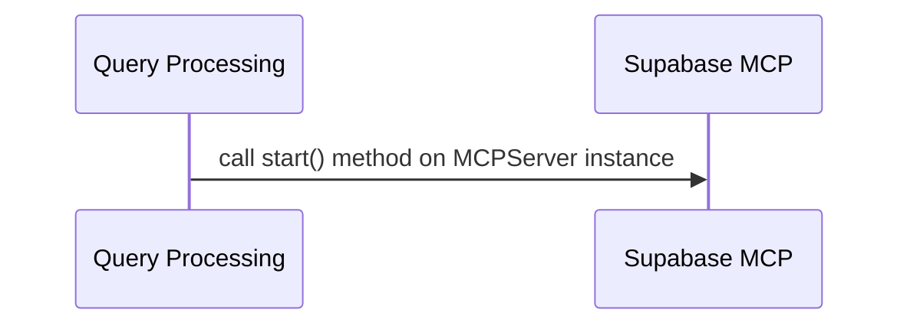

# Chapter 2: MCP Server Initialization

Here is the integrated chapter markdown:

# Chapter 2: MCP Server Initialization
=============================================

Welcome back to Supabase MCP! In our previous chapter, [Environment Configuration Handling](01_environment_configuration_handling_.md), we learned how to set up our environment variables correctly. Now that we have a solid foundation for our environment configuration, it's time to dive into the exciting world of MCP servers!

## What is an MCP Server?
------------------------

An MCP (Model Context Protocol) server acts as a bridge between AI tools and your Supabase database. It allows you to connect your models and algorithms with your database, making it easier to build and deploy AI-powered applications.

## Initializing the MCP Server
-----------------------------

Initializing the MCP server is like setting up a new game console for playing games. You need to configure it correctly so that it can communicate with your Supabase database. Let's break down the process into simple steps:

### Step 1: Importing Dependencies

First, you'll need to import the necessary dependencies in your Python script. For this example, we'll use the `supabase-mcp` library:
```python
from supabase_mcp import MCPServer
```
 Sequence Diagram for importing dependencies:


### Step 2: Configuring the MCP Server

Next, you'll need to configure the MCP server with your Supabase project URL and service role key. You can do this by creating an instance of the `MCPServer` class and passing in your environment variables:
```python
mcp_server = MCPServer(
    supabase_url=os.getenv("SUPABASE_URL"),
    supabase_key=os.getenv("SUPABASE_SERVICE_KEY")
)
```
Flowchart for configuring the MCP server:
```mermaid
flowchart LR
    participant QP as Query Processing
    participant Supabase MCP
    QP->>Supabase MCP: create instance of MCPServer class
    Subgraph Config
        Supabase MCP-- "pass in environment variables"-->|URL and Service Key|
        URL and Service Key-.->QD as "os.getenv"
    end
```

### Step 3: Starting the MCP Server

Finally, you'll need to start the MCP server. You can do this by calling the `start()` method on your `MCPServer` instance:
```python
mcp_server.start()
```
Sequence Diagram for starting the MCP server:


## Example Use Case: Authenticating Users

Let's say you have a web app that uses Supabase as its backend database. Your users might be trying to log in, and your app needs to authenticate them using their email and password. In this case, the MCP server can help you connect your models with your database.

Here's an example code snippet that shows how to use the MCP server to authenticate a user:
```python
from supabase_mcp import MCPServer

mcp_server = MCPServer(
    supabase_url=os.getenv("SUPABASE_URL"),
    supabase_key=os.getenv("SUPABASE_SERVICE_KEY")
)

# Get the user's email and password from the request
user_email = request.form["email"]
user_password = request.form["password"]

# Use the MCP server to authenticate the user
auth_response = mcp_server.auth_user(user_email, user_password)

if auth_response:
    # User is authenticated successfully!
    return "Welcome, {}".format(user_email)
else:
    # Authentication failed. Return an error message.
    return "Invalid email or password"
```
Flowchart for authenticating users:
```mermaid
flowchart LR
    participant User as "User"
    participant Supabase MCP
    User-- "provide email and password"-->Supabase MCP
    Supabase MCP-- "authenticate user"-->|response|
```

## Conclusion
----------

Initializing the MCP server is a crucial step in building AI-powered applications with Supabase. By following these simple steps and using the `supabase-mcp` library, you can connect your models with your database and build robust applications that leverage the power of machine learning.

In our next chapter, [Supabase Client Wrapper](03_supabase_client_wrapper_.md), we'll explore how to use the MCP server as a client wrapper for Supabase. This will allow us to interact with our Supabase database using a more intuitive API.

Happy building!...

---

Generated by [TutorialForge](https://github.com/your-username/tutorialforge) - AI-Powered Codebase Tutorial Generator